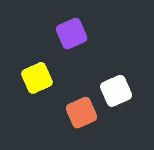
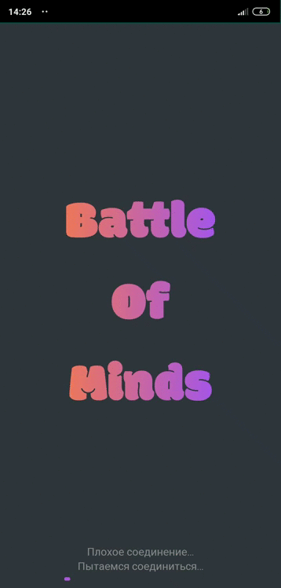
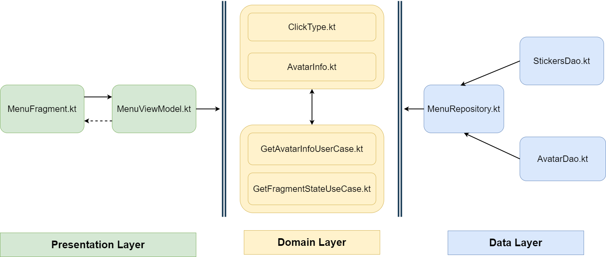

# BattleOfMindsGame
Проект для обучения в OTUS.
Игра в стиле "Битва Умов", где игроки сорвенуются в правильных ответах на вопросы.
# ДЗ №2. Кастомный бесконечный progressBar

[CustomLoadingValueAnimator.kt](https://github.com/bonusdev/BattleOfMindsGame/blob/master/app/src/main/java/com/bonusgaming/battleofmindskotlin/custom_views/CustomLoadingValueAnimator.kt)



# ДЗ №3. Работа с сетью
При первой загрузке подгружаем картинки с Google Cloud Storage.
Скачиваем через [Retrofit](https://github.com/bonusdev/BattleOfMindsGame/blob/master/app/src/main/java/com/bonusgaming/battleofmindskotlin/web/ImagesUrlApi.kt) список картинок, затем через [Picasso](https://github.com/bonusdev/BattleOfMindsGame/blob/master/app/src/main/java/com/bonusgaming/battleofmindskotlin/di/module/PicassoModule.kt) подгружаем картинки в постоянную память. Используем архитектуру MVVM: [View - LoadingAssetsFragmnet.kt ](https://github.com/bonusdev/BattleOfMindsGame/blob/master/app/src/main/java/com/bonusgaming/battleofmindskotlin/loading_assets/LoadingAssetsFragment.kt), [ViewModel - LoadingAssetsViewModel.kt](https://github.com/bonusdev/BattleOfMindsGame/blob/master/app/src/main/java/com/bonusgaming/battleofmindskotlin/loading_assets/LoadingAssetsViewModel.kt), [Model - LoadingAssetsModel.kt](https://github.com/bonusdev/BattleOfMindsGame/blob/master/app/src/main/java/com/bonusgaming/battleofmindskotlin/loading_assets/LoadingAssetsModel.kt)



# ДЗ №4. Proguard rules.
POJO классы [CloudStorageItem и Item](https://github.com/bonusdev/BattleOfMindsGame/blob/master/app/src/main/java/com/bonusgaming/battleofmindskotlin/web/CloudStorageItem.kt) после обфускация выдают ошибку:

```
2020-02-28 23:48:59.916 18907-18907/? W/System.err: java.lang.NullPointerException: throw with null exception
2020-02-28 23:48:59.916 18907-18907/? W/System.err:     at c.a.a.c.b.a(:1)
```
Классы добавлены в [proguard-rules.pro](https://github.com/bonusdev/BattleOfMindsGame/blob/master/app/proguard-rules.pro):
```
-keepclassmembers class com.bonusgaming.battleofmindskotlin.web.CloudStorageItem { <fields>; }
-keepclassmembers class com.bonusgaming.battleofmindskotlin.web.Item { <fields>; }
```

# ДЗ №5. Реализация MVVM архитектуры.
Создание аватара отображается во фрагементе [(CreatingAvatarFragment.kt)](https://github.com/bonusdev/BattleOfMindsGame/blob/master/app/src/main/java/com/bonusgaming/battleofmindskotlin/creating_avatar/CreatingAvatarFragment.kt), который взаимодействует с [CreatingAvatarViewModel.kt](https://github.com/bonusdev/BattleOfMindsGame/blob/master/app/src/main/java/com/bonusgaming/battleofmindskotlin/creating_avatar/CreatingAvatarViewModel.kt), а последний взаимодействует с [CreatingAvatarModel.kt](https://github.com/bonusdev/BattleOfMindsGame/blob/master/app/src/main/java/com/bonusgaming/battleofmindskotlin/creating_avatar/CreatingAvatarModel.kt)


# ДЗ №6. Clean Architecture.
Разбил на Presentation, Domain и Data слои фичу-экран главное меню [Main Menu Feature](https://github.com/bonusdev/BattleOfMindsGame/tree/master/app/src/main/java/com/bonusgaming/battleofmindskotlin/main)




